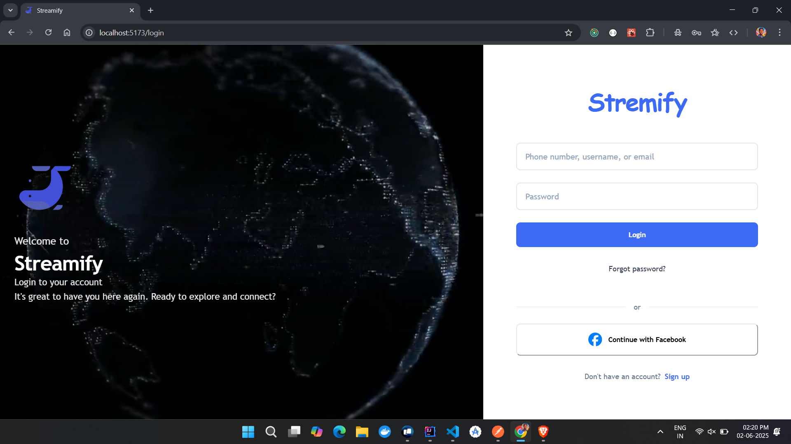
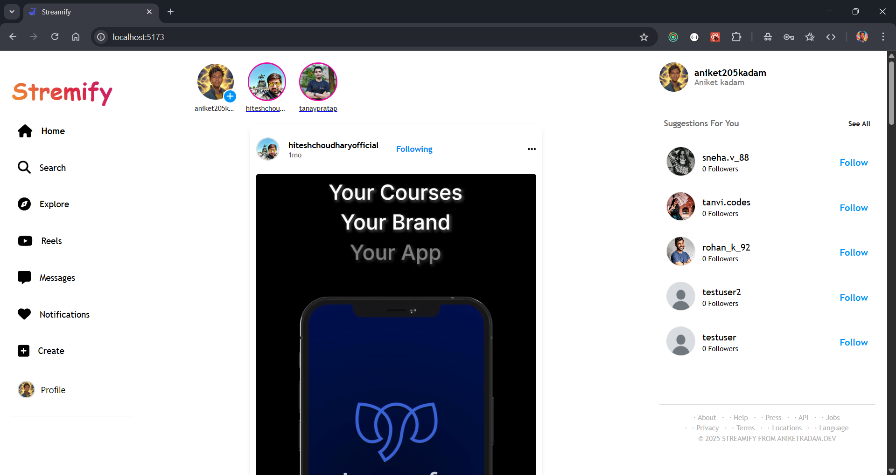
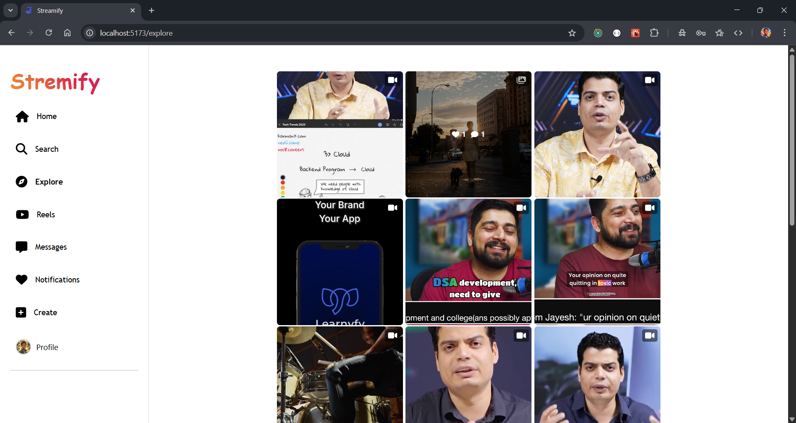
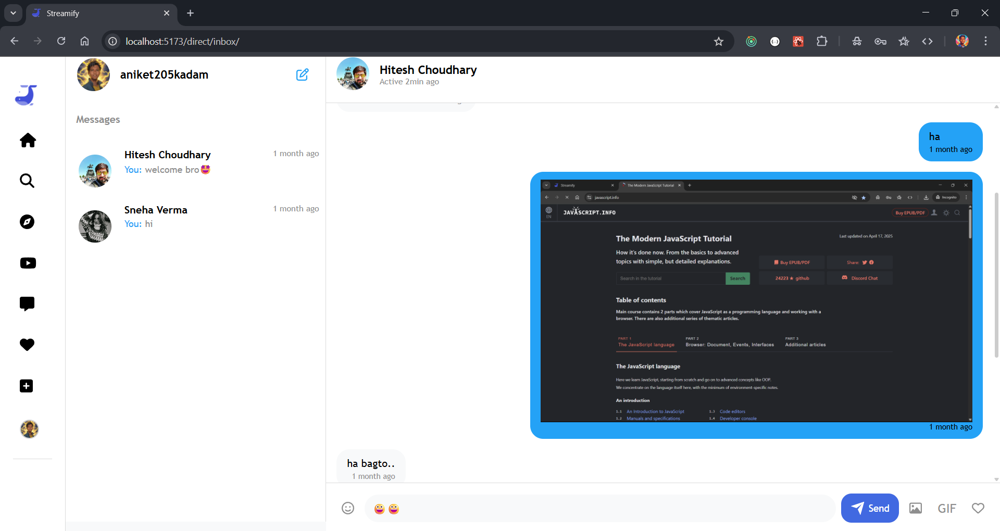
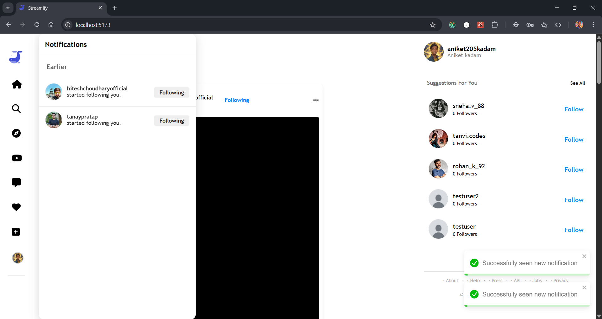
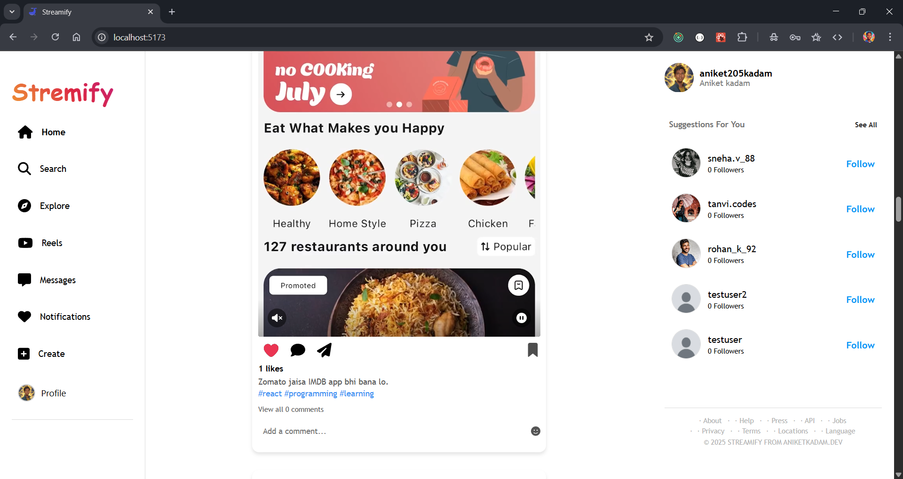
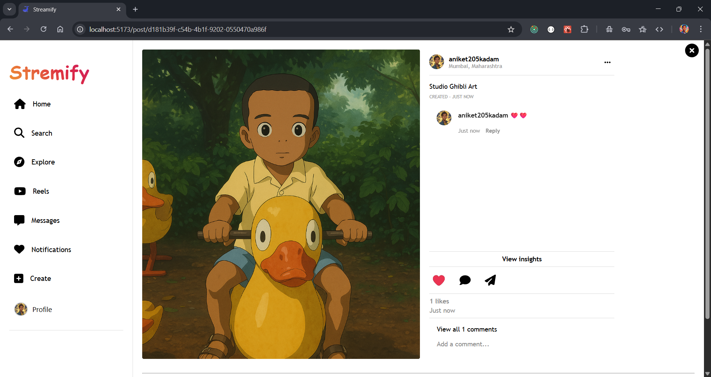
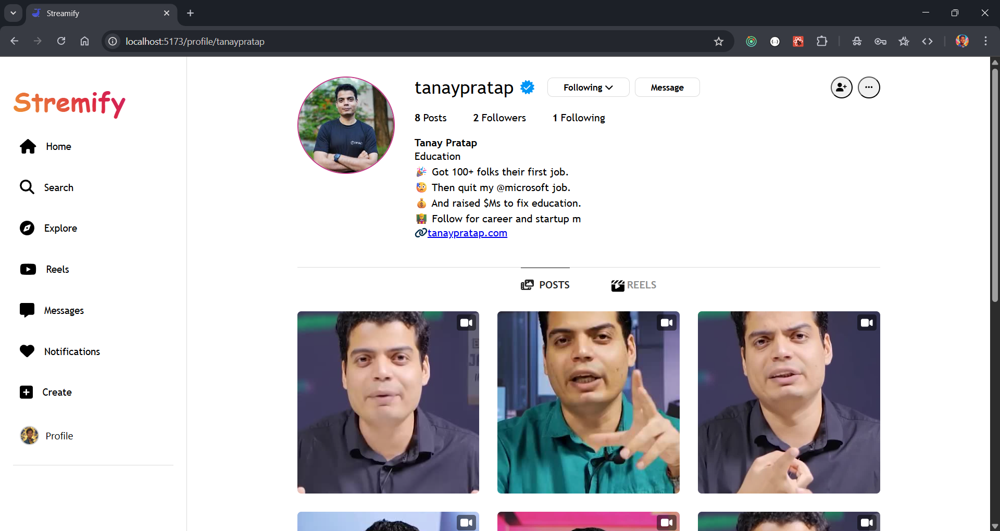
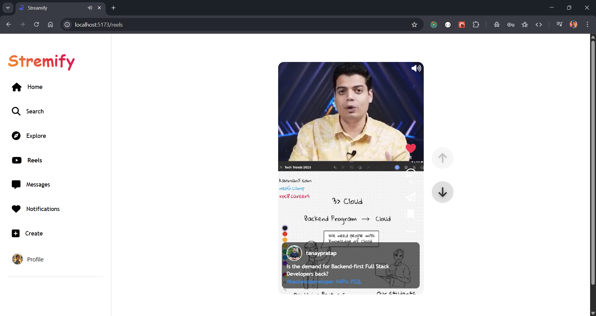

# Streamify – Social Media App
A full-featured social media platform that blends video sharing (Reels), real-time messaging, stories, and AI-based virtual friends. Built with Java, Spring Boot, React.js, Docker, and enhanced using Spring AI + Ollama. Hosted on AWS EC2 for scalability.

## Features
🔹 🎥 Reels & Posts
→ Users can create posts and short video reels with FFmpeg-powered video optimization and thumbnails.

🔹 💬 Real-Time Chat
→ Built with WebSocket; secure and fast messaging between users.

🔹 🧠 Virtual AI Friends
→ Integrated Spring AI + Ollama for intelligent chatbots that simulate virtual companions.

🔹 📨 OTP & Secure Password Reset
→ Email-based OTP verification and password reset using secure tokenized links.

🔹 📦 Pagination + Infinite Scroll
→ Optimized performance: only 5 posts load per scroll.

🔹 🕒 12-Hour Stories
→ Story feature where content disappears after 12 hours.

🔹 🔔 Notifications
→ Real-time alerts for new messages, likes, follows, and story views.

🔹 🛡️ Authentication
→ Secure login and APIs with JWT and RESTful architecture.

## Screenshots

## Future Enhancements
- Virtual Friend Feature impl by frontend
- React Native mobile app
- Better AI personalization
- Video processing using Ffmpeg

